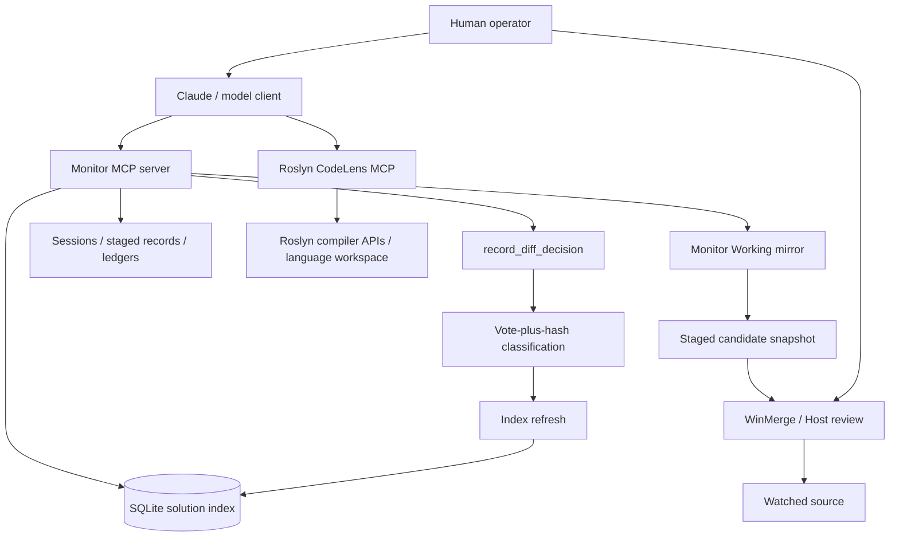
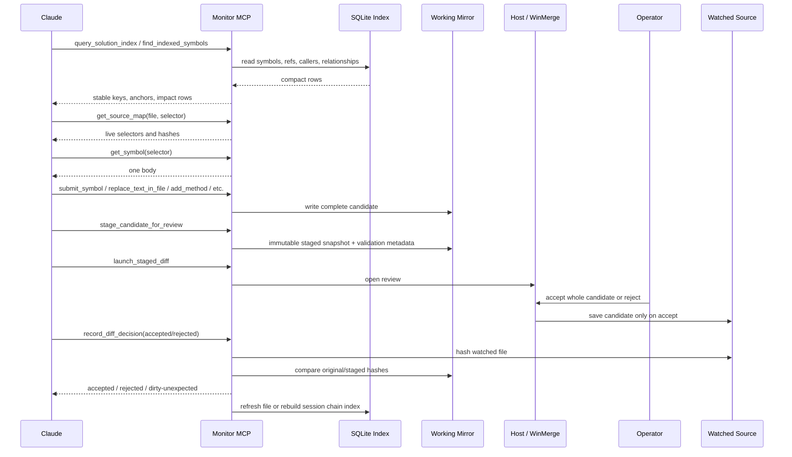

# MonitorBaseClaude Human System README

This is the human memory map for MonitorBaseClaude: what the pieces are, how an AI edit is supposed to move through the system, what the SQLite solution index really contains, and how the two MCP tool surfaces fit together.

Use this when you come back later and need to remember why the workflow exists, not just which command to run.

## One-Sentence Model

MonitorBaseClaude lets a cloud model reason over a local compiler-backed map, compose edits into a monitor-owned Working mirror, and change watched source only after human diff review and vote-plus-hash verification.

The core idea is:

```text
Cloud model reasons -> local monitor composes/stages -> human reviews -> hashes classify -> index refreshes
```

## Main Pieces

| Piece | What it owns | Why it exists |
| --- | --- | --- |
| WinForms app, `MonitorBaseClaude.csproj` | Human/operator UI, MCP hub visibility, Solution Index viewer, review/test surfaces | Lets a person see the workflow and inspect the index instead of trusting hidden model state. |
| Monitor MCP server, `MonitorBaseClaude.McpServer` | Safe file reads, source maps, Working candidates, staged records, review launch, review decision, solution index queries | This is the agent-safe workflow API. It is not a raw file editor. |
| Roslyn CodeLens MCP | Live Roslyn/compiler-style semantic navigation: diagnostics, references, callers, implementations, type overview, call graph | This is the semantic microscope. It helps answer compiler questions but does not own editing. |
| `SolutionIndexService` | SQLite symbol/reference/caller/relationship index for watched C# source | Gives Claude a fast, persisted, inspectable map before it reads bodies or edits. |
| `Working\...` | Monitor-owned mirrors, staged files, sessions, history, ledgers, index DBs | Keeps generated monitor state out of watched source. |
| WinMerge / Host review | Actual save/no-save decision on watched source | Keeps mutation human-visible and all-or-none. |
| Smoke and corpus tests | Fixture, DBV2, and external compiler-style coverage | Proves the index/edit rails against known answers, not vibes. |

## High-Level Architecture



## Source Boundaries

The monitor deliberately separates three worlds:

| World | Examples | Mutation rule |
| --- | --- | --- |
| Product/monitor source | `MonitorBaseClaude`, `MonitorBaseClaude.McpServer`, docs, tests | Codex can edit normally in this repo. |
| Watched project source | DBV2/WebViewer/etc configured as the observed solution | Claude/model edits must go through Monitor staging and human review. |
| Monitor-owned generated state | `Working\`, `Working\Indexes`, `Working\History`, sessions, staged snapshots | Tools own this. It is not product source and not watched project source. |

Generated monitor state belongs under the monitor, not inside the watched project.

## The Solution Index

The solution index is the map Claude should ask for before reading file bodies.

It is built from Roslyn semantic APIs over watched C# source and persisted as SQLite under:

```text
Working\Indexes\<observedRootKey>\solution-index.sqlite
```

It currently stores:

- file rows: path, hash, length, timestamp, parse status, diagnostic count, stale flag
- symbol rows: stable key, path, hash, namespace, containing type, kind, name, signature, source anchor, selector JSON, accessibility, generated/partial flags
- reference rows: target symbol, file, caller symbol, reference kind, line/column, snippet
- call-site rows: callee symbol, file, caller symbol, line/column, snippet
- relationship rows: partials, inheritance, overrides, interface implementations
- diagnostic rows: severity, id, message, line span

What it is good for:

- "What symbols are in this file?"
- "What calls this method?"
- "What references this property/type/field?"
- "What partials/overrides/interface relationships matter?"
- "Is this file stale or diagnostic-bearing?"
- "What stable key should Claude pass to the next index tool?"

What it is not trying to be yet:

- full MSBuild graph identity
- NuGet/framework internals
- generated code that only exists during build and is not physically present
- Razor markup semantics
- a replacement for `dotnet build`

## Index-First Read Flow

When Claude knows the file, it should not guess keys or read the whole file first. It should ask the index for the file-local symbol table:

```text
query_solution_index(scope: "file", value: "Data/BaseTableRepository.cs")
```

That returns symbols with `StableSymbolKey`, `SourceAnchor`, `SelectorJson`, `Kind`, `Name`, `Signature`, and containing type/namespace.

Then Claude uses the returned key:

```text
find_indexed_references(stableSymbolKey)
find_indexed_callers(stableSymbolKey)
find_indexed_relationships(stableSymbolKey)
get_indexed_symbol(stableSymbolKey)
```

The important rule: Claude should not manually compose stable keys from text. Stable keys come from index/source-map results.

## Source Map vs. Solution Index

These are related but not interchangeable:

| Surface | Best for | Authority level |
| --- | --- | --- |
| Solution index | Broad navigation, file/symbol discovery, callers, references, relationships, diagnostics, stable key lookup | Persisted Roslyn-derived map. Good first signal. |
| Source map | Live C# file/folder/namespace structure, selector JSON, current file hash, edit-grade targeting | Same-session freshness hop before mutation. |
| `get_symbol` | Actual body text for one selected C# symbol | Smallest body read before composing an edit. |
| `get_file` | Full file body when unavoidable and below 32KB | Last resort for small files when map/body tools are not enough. |

If a candidate target came from cached/index data, do a live selector/hash hop before mutation:

```text
index row -> get_source_map(scope: "file", mode: "selector") or check_file_hash -> get_symbol -> compose candidate
```

## Normal Edit Loop



The Monitor MCP server does not directly overwrite watched source. The physical mutation path is the human review surface saving the candidate.

## Multi-File Edits

Coupled C# edits must validate together:

```text
start_monitor_session
compose Working candidate A
stage candidate A
compose Working candidate B
stage candidate B
overlay compile sees A+B together
review A
record decision A
review B
record decision B
record_diff_decision triggers one index rebuild when the chain completes
```

Do not accept file A, then compose file B against the watched-source intermediate state. Compose later candidates against the full proposed Working overlay.

## Review Gate

The diff is all-or-none:

- no partial hunk merge
- no repairing the candidate in WinMerge
- accept means the whole staged candidate was saved
- reject means watched source stayed at the original baseline

`record_diff_decision` does not trust the reported word by itself. It checks hashes:

| Classification | Meaning |
| --- | --- |
| `accepted` | Operator reported accepted and watched hash equals staged candidate hash. |
| `accepted-normalized` | Accepted with only BOM/EOL-normalized differences. |
| `rejected` | Operator reported rejected and watched hash equals original baseline hash. |
| `dirty-unexpected` | Operator report and watched hash disagree, or watched hash matches neither original nor staged. |

`dirty-unexpected` blocks further staging on that file until explicit refresh/recovery.

## Razor And Large Files

Razor is not treated as normal C# symbol surgery. For `.razor` and `.cshtml`:

- prefer `replace_text_in_file` for exact small changes
- use `replace_span_in_file` when line/column bounds are already known
- use `submit_file` for new files, broad rewrites, or unsafe narrow edits

For cold-session reads:

- below 32KB: `get_file` is allowed when index/source-map/symbol context is not enough
- 32KB and above, or when unsure: call `refresh_file`, then chunk-read the returned Working path

`refresh_file` does not chunk. It refreshes the monitor-owned Working mirror and returns the local path. The client then reads bounded chunks from that path.

## Monitor MCP Tool Surface

The Monitor MCP server is the workflow/safety surface. It currently exposes roughly 55 tools. They fall into these groups:

| Group | Representative tools | What they do |
| --- | --- | --- |
| Status and help | `get_monitor_status`, `get_workflow_status`, `get_self_check`, `get_tool_manifest`, `get_staging_guide`, `get_smoke_test_catalog` | Let a client discover configuration, rules, and debug catalog. |
| Solution index | `refresh_solution_index`, `refresh_solution_index_file`, `refresh_file_and_index`, `get_solution_index_status`, `get_solution_index_tree`, `get_solution_index`, `query_solution_index`, `find_indexed_symbols`, `get_indexed_symbol`, `find_indexed_references`, `find_indexed_callers`, `find_indexed_relationships` | Read or refresh the SQLite symbol/reference/caller/relationship index. |
| Session state | `start_monitor_session`, `list_monitor_sessions`, `get_monitor_session`, `list_session_staged_records`, `record_monitor_session_event` | Give agents explicit durable handles instead of implicit connection memory. |
| File and structure reads | `refresh_file`, `get_file`, `check_file_hash`, `find_file`, `get_file_outline`, `get_source_map`, `get_symbol` | Read current watched source safely and narrowly. |
| Candidate composition | `submit_file`, `submit_symbol`, `replace_text_in_file`, `find_text_span`, `replace_span_in_file`, `add_using`, `remove_using`, `set_type_partial`, `add_symbol`, `add_field`, `add_property`, `add_method`, `add_constructor`, `add_nested_type`, `remove_symbol` | Write proposed content to the monitor-owned Working mirror only. |
| Review and decision | `stage_candidate_for_review`, `launch_staged_diff`, `record_diff_decision`, `compare_file` | Snapshot candidates, launch review, and classify outcomes by vote-plus-hash. |
| History and cleanup | `list_monitor_runs`, `get_monitor_run`, `list_ledgers`, `get_ledger`, `prune_monitor_history`, `list_watched_projects` | Inspect monitor history and local watched-project discovery. |

### Monitor Tool Mental Model

```text
Index tools answer: what exists and what is connected?
Source-map/symbol tools answer: what exact source will I edit?
Composition tools answer: what candidate should exist in Working?
Review tools answer: what did the human accept or reject?
History tools answer: what happened before?
```

## Roslyn CodeLens MCP Tool Surface

Roslyn CodeLens MCP is the live semantic analysis surface. It should be used for compiler-backed questions, not for mutation.

Important tools and patterns:

| Tool | Main argument shape | Use it for |
| --- | --- | --- |
| `list_solutions` | no special remembered shape | Confirm Roslyn can see the intended solution. |
| `get_diagnostics` | optional `project`, `severity`, `includeAnalyzers` | Compiler warning/error inventory. |
| `search_symbols` | `query` | Discover candidate types/members by name. |
| `get_type_overview` | `typeName` | Confirm namespace, members, dependencies, hierarchy, and file diagnostics for a type. |
| `find_references` | `symbol` | Find references to a type/member. Do not pass `symbolName` or `query`. |
| `find_callers` | `symbol` | Find method call sites. Useful for async propagation. |
| `get_call_graph` | `symbol`, `direction`, `maxDepth`, `maxNodes` | Inspect caller/callee chains without manual recursion. |
| `analyze_change_impact` | `symbol` | Estimate blast radius for signature changes, renames, removals, async conversion. |
| `find_implementations` | `symbol` | Find implementers/derived types, especially interfaces and virtual/abstract paths. |
| project dependency tools | project name/path depending on tool schema | Understand project references and dependencies. |

The common Roslyn argument mistake is passing the wrong name:

```json
{"query":"DatabaseRepository.GetAll"}
```

to a tool that expects:

```json
{"symbol":"DatabaseRepository.GetAll"}
```

The safe ladder is:

```text
search_symbols(query)
-> get_type_overview(typeName)
-> find_references/find_callers/analyze_change_impact(symbol)
-> Monitor source map/get_symbol for files that will be edited
```

## When To Use Which MCP

| Question | Use Monitor MCP | Use Roslyn CodeLens MCP |
| --- | --- | --- |
| What files/symbols are in the watched source index? | Yes | Maybe, but Monitor is cheaper. |
| What is the stable key for a file-local symbol? | Yes: `query_solution_index(scope: "file")` | No. |
| What calls/references this indexed source symbol? | Yes first: `find_indexed_callers/references` | Use as live sanity check or deeper semantic query. |
| What overrides or implements this symbol? | Yes first: `find_indexed_relationships` | Use `find_implementations` for live compiler perspective. |
| What exact body should be edited? | Yes: `get_source_map` then `get_symbol` | No mutation authority. |
| Should a method async change propagate? | Monitor index for current callers; Roslyn `find_callers`, `get_call_graph`, or `analyze_change_impact` as needed | Yes, useful live semantic backup. |
| How do I stage/review/accept an edit? | Monitor only | Never. |
| What does the compiler currently complain about? | Monitor overlay validation for staged candidates | Roslyn `get_diagnostics` for solution health. |

## Proof And Tests

The important testing idea is that the index is checked against compiler-style known answers.

Current proof layers:

- fixture matrix smoke in `MonitorBaseClaude.ToolSmokeTests`
  - generated fixture
  - Roslyn target counts
  - Monitor reference/caller/relationship counts
  - current fixture passes 68/68
- DBV2 caller/index smokes
  - real watched project cross-section
  - all indexed method/constructor callers
- external corpus under `C:\VSCodeProjects\MonitorBaseClaudeTests`
  - local-only sibling repo
  - `.cs.tst` source samples with `/*<bind>*/.../*</bind>*/` markers
  - `expected.json` sidecar known answers
  - asserted cases test normal source semantics
  - informational cases document current project-system boundaries

The bind-marker model is the key: Roslyn is asked what symbol is under the marker, and Monitor must return the matching indexed target/reference/caller/relationship behavior.

## Current "Mean Teacher" End-To-End Test

The best live proof of the full workflow is an async repository conversion:

```text
Pick one low-fanout repository method.
Convert it to async.
Update every actual caller.
Do not use .Wait(), .Result, GetAwaiter().GetResult(), Task.Run sync bridges, or helper bridge wrappers.
If a caller now awaits, make that caller async and continue propagation until the overlay/build is clean.
Stage all coupled files in one monitor session.
Accept/reject through WinMerge.
Check IndexRefresh.
Re-query the index and confirm the async method/callers are visible.
```

This tests the real thing:

- index-first discovery
- caller propagation
- async reasoning
- no sync-over-async shortcuts
- multi-file staging
- overlay compile validation
- review gate
- automatic index refresh
- post-change query correctness

## What To Inspect In The WinForms App

The `Solution Index` tab is a read-only viewer for the SQLite index. It is not an editor.

Use it to answer skeptical questions:

- What files did we index?
- What symbols did we see?
- What is the stable key?
- Who references/calls this symbol?
- What partial/inheritance/override/interface relationships exist?
- Are there diagnostics or stale files?
- What raw row data would Claude receive?

The bottom inspector tabs are:

- `References`
- `Callers`
- `Relationships`
- `Diagnostics`
- `Raw`

The `Raw` tab is there for copyable evidence: selected symbol JSON, counts, stable key, source anchor, references, callers, and relationships.

## If Something Seems Wrong

Use this triage path:

1. Check the `Solution Index` UI and `get_solution_index_status`.
2. If file data is stale, run `refresh_solution_index_file` or rebuild the index.
3. Query by file first:

   ```text
   query_solution_index(scope: "file", value: "<relative path>")
   ```

4. Use the returned `StableSymbolKey`, not a hand-built key.
5. Check references/callers/relationships.
6. If the index missed a real C# symbol/reference, treat that as a test case:
   - capture file
   - capture symbol
   - capture bind/call site
   - add a fixture or external corpus case
   - fix the indexer
7. Use grep only as a forensic tool after an index/compiler surprise, not as first-pass C# discovery.

## Short Glossary

| Term | Meaning |
| --- | --- |
| Watched source | The real project being edited, such as DBV2 or WebViewer. |
| Working mirror | Monitor-owned editable copy under `Working\...`; candidate tools write here. |
| Staged record | Immutable snapshot of a completed candidate plus baseline hashes and validation metadata. |
| Stable symbol key | Persisted index identity for a source symbol. Get it from index/source-map rows. Do not invent it. |
| Source anchor | Human-readable path/line/column span for a symbol. Useful for inspection, not a replacement for stable keys. |
| Overlay compile | Validation that staged Working candidates compile together before review. |
| Vote-plus-hash | `record_diff_decision` classification based on operator report plus watched/original/staged hashes. |
| IndexRefresh | Automatic index refresh returned after accepted decisions so the next query sees current source. |
